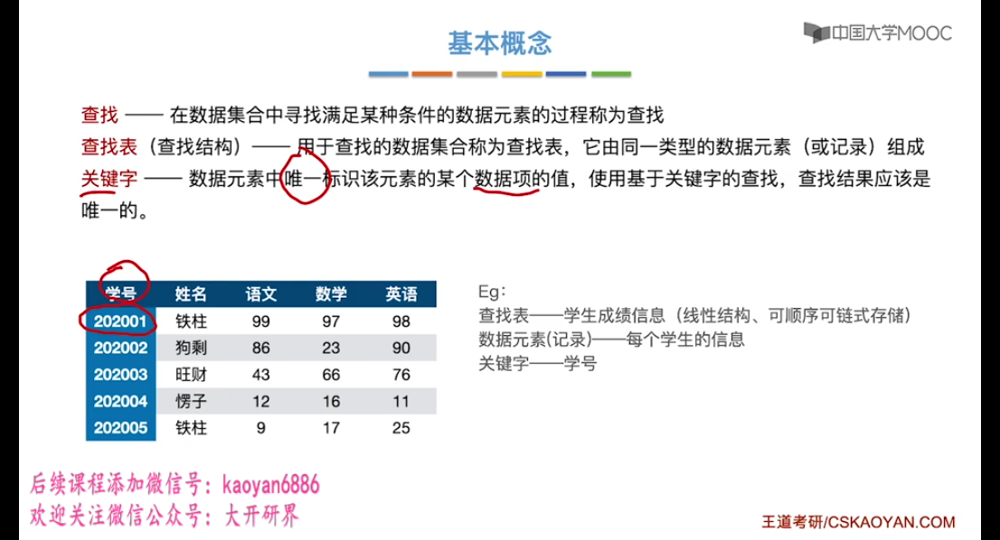
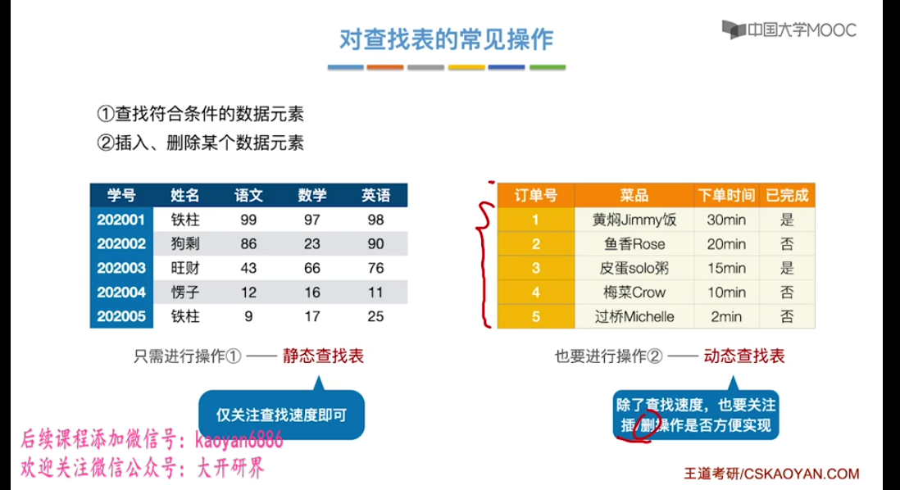
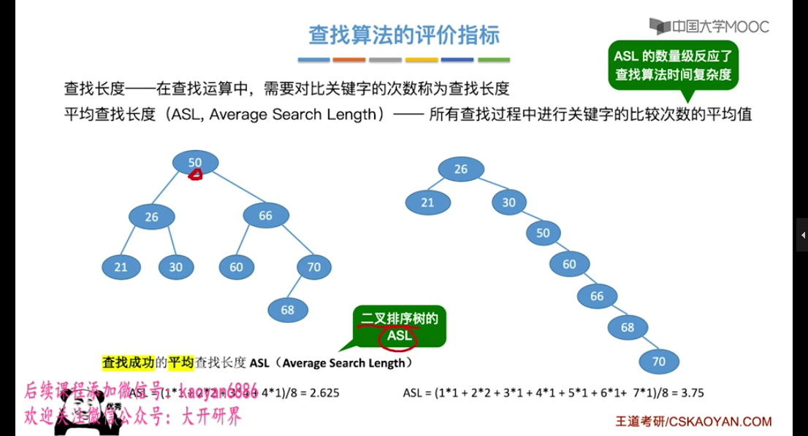
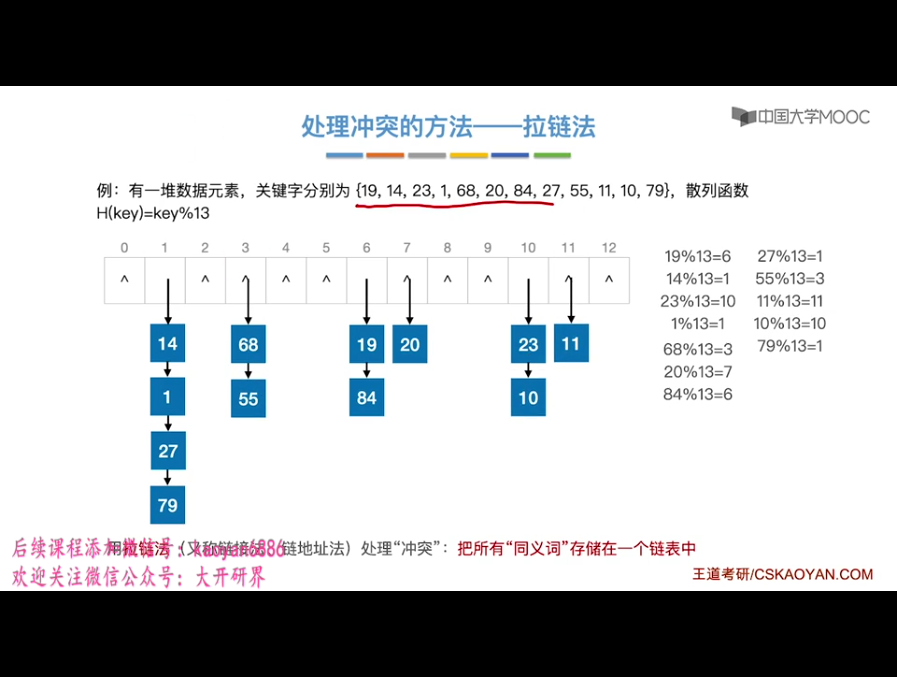
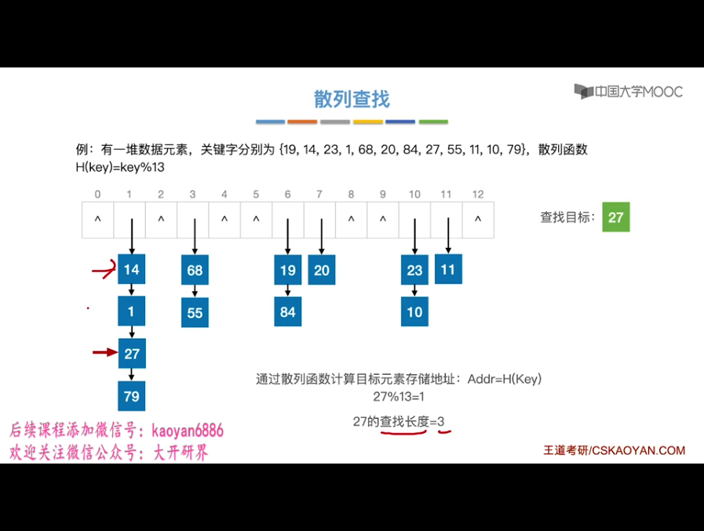

### 定义

### 查找表的常见操作

### 查找算法的评价指标

### 顺序查找
顺序查找，又叫线性查找，通常用于线性表

### 二分查找

### 分块查找

### 树的查找
* 二叉查找树
* B树

### 散列表

#### 常见的散列函数
* 除留余数法
* 直接定址法
* 数字分析法
* 平方取中法

#### 处理冲突的方法
* 拉链法(链地址法)
* 开放定址法
  * 线性探测法
  * 平方探测法
  * 伪随机序列法
* 再散列法